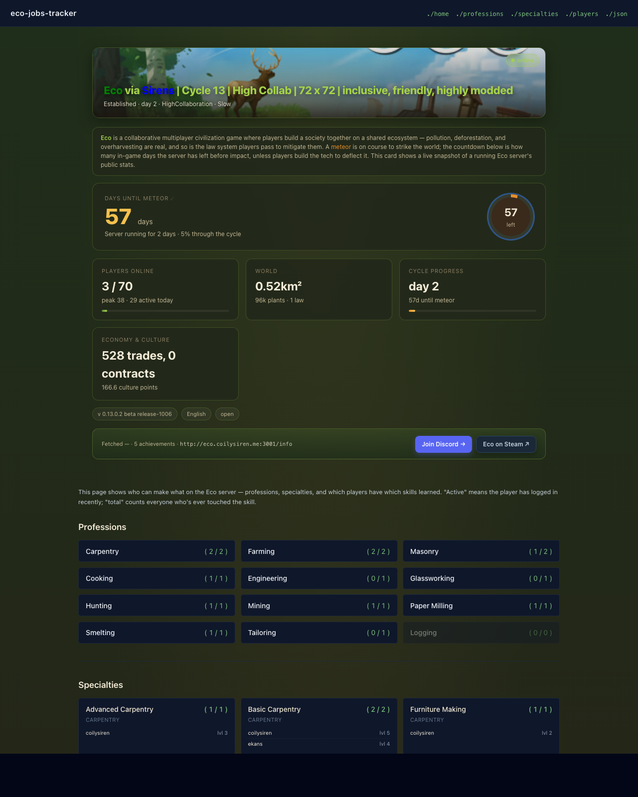

# eco-spec-tracker

What it's like to build a read-only "who can make what" board for an **Eco** [1]
server in 300 lines of FastAPI — a single page that lists every player, every
profession, every learned specialty, with live `active / total` counts.

Paired with a small C# Eco mod that exposes `GET /api/v1/skills`: the mod is
the source of truth, this app is the view. Today the app still reads mock data
(`UPSTREAM_URL` unset); point it at the shell harness on `:5100` or the real
mod on your server and it switches over transparently.


## Screenshot

[](https://eco-jobs-tracker.coilysiren.me/)

Live at [eco-jobs-tracker.coilysiren.me](https://eco-jobs-tracker.coilysiren.me/).

## What it renders

```
┌─ eco-jobs-tracker ─────────────────────── ./home ./professions ./specialties ┐
│  # who_does_what && when_active                                              │
│                                                                              │
│  ┌ live eco server card (via eco-mcp-app, same render as the MCP widget) ──┐ │
│  │  Eco via Sirens · day 2 · HighCollaboration · Slow · ● online           │ │
│  └─────────────────────────────────────────────────────────────────────────┘ │
│                                                                              │
│  Professions                                                                 │
│    Carpentry       ██████▒▒▒▒  3 / 5 active                                  │
│    Masonry         █████▒▒▒▒▒  2 / 4 active                                  │
│    …                                                                         │
│                                                                              │
│  Specialties                                                                 │
│    Basic Carpentry     coilysiren (L5) · ekans (L4) · …                      │
│    Advanced Masonry    hammerhand (L3) · …                                   │
│                                                                              │
│  Players                                                                     │
│    coilysiren   · active · Carpentry ×3                                      │
│    ekans        · active · Carpentry, Mining                                 │
│    …                                                                         │
└──────────────────────────────────────────────────────────────────────────────┘
```

## How it works

Two processes:

1. **FastAPI app** (`src/eco_spec_tracker/main.py`) — Jinja2 + HTMX + Tailwind
   Play CDN. Serves `/`, `/professions`, `/specialties`, `/players`, HTMX
   partials under `/partials/*`, and a JSON mirror under `/api/v1/*`. The live
   Eco server status card at the top is imported directly from the sister
   `eco-mcp-app` [2] package — same render path as the MCP widget, so visuals
   stay in lockstep.
2. **C# Eco mod** (`mod/src/`) — a standard ModKit [3] UserCode mod that
   registers `GET /api/v1/skills` and returns every player's learned
   specialties. The `mod/shell/` project is an ASP.NET Core harness that
   serves the same route with canned data on `:5100`, so you can iterate
   against a live C# HTTP server without booting Eco.

The Python app's `upstream.py` module calls the `/api/v1/skills` endpoint when
`UPSTREAM_URL` is set and falls back to in-repo mock data otherwise — so the
web UI is always useful, even offline.

## Quick start

```sh
make build-native
make run-native      # http://localhost:4100 with autoreload
```

With the C# shell harness also running (in a second terminal):

```sh
make run-shell                                     # :5100
UPSTREAM_URL=http://localhost:5100/api/v1/skills make run-native
```

## Tests

```sh
inv test             # or: uv run pytest
```

Smoke suite under `tests/test_smoke.py`: every page, every `/api/v1/*`, the
`/partials/eco-card` render with the upstream Eco `/info` stubbed via
[respx](https://lundberg.github.io/respx/), and the upstream parser fed a
mod-shaped fixture.

## Build the real mod

```sh
make build-mod       # mod/src/bin/Release/net10.0/EcoJobsTracker.dll
```

Drops into an Eco server's `Mods/UserCode/` directory (the exact path on
`kai-server` is TBD; see `CLAUDE.md` open questions).

## Deploy

Follows the `coilysiren/backend` template [4] — Dockerfile, Makefile, k3s
manifest in `deploy/main.yml`, GitHub Actions in `.github/workflows/`. Target:
`eco-jobs-tracker.coilysiren.me`.

## See also

- [eco-mcp-app](https://github.com/coilysiren/eco-mcp-app) — sister repo, the
  inline Claude Desktop widget that renders the Eco server status card. This
  repo imports it directly as a git dep so the card stays in lockstep.
- [coilysiren/backend](https://github.com/coilysiren/backend) — canonical
  deploy template.
- [StrangeLoopGames/EcoModKit](https://github.com/StrangeLoopGames/EcoModKit) —
  the Eco modding API surface the C# side uses.
- [Eco modding docs](https://docs.play.eco/) and the [Eco wiki](https://wiki.play.eco/en/Modding).

## License & credits

MIT. Eco is a trademark of **Strange Loop Games** [5]; this project is an
unofficial fan tool and is not affiliated with StrangeLoopGames.

## References

1. <https://play.eco/>
2. <https://github.com/coilysiren/eco-mcp-app>
3. <https://github.com/StrangeLoopGames/EcoModKit>
4. <https://github.com/coilysiren/backend>
5. <https://www.strangeloopgames.com/>
